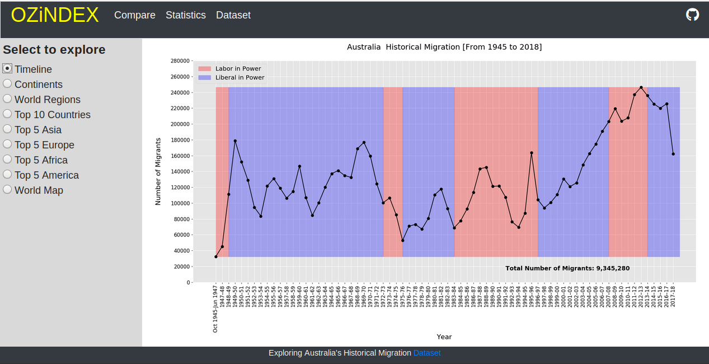
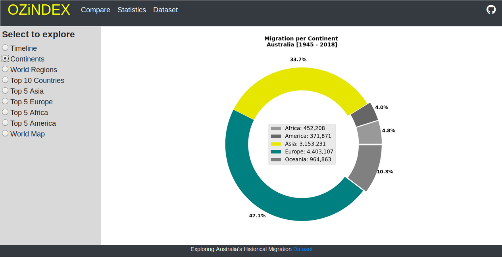
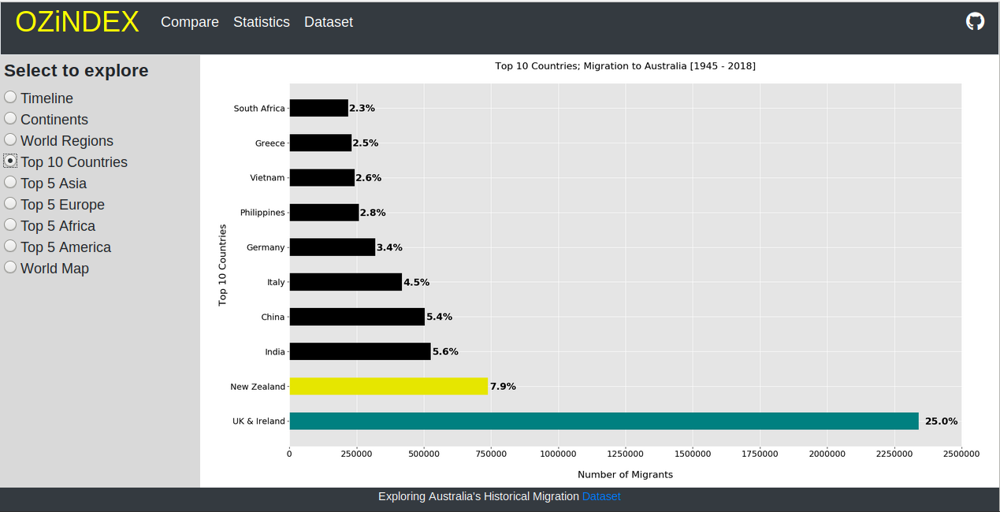
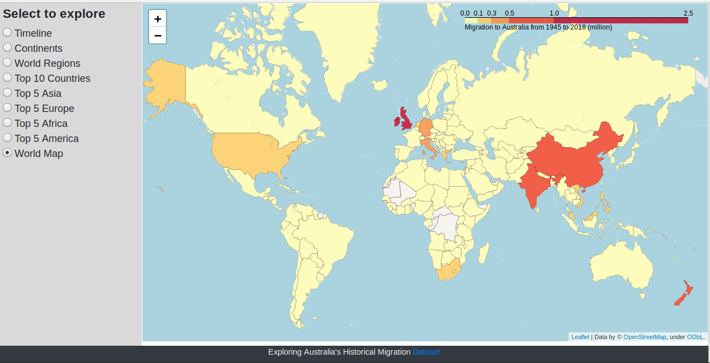
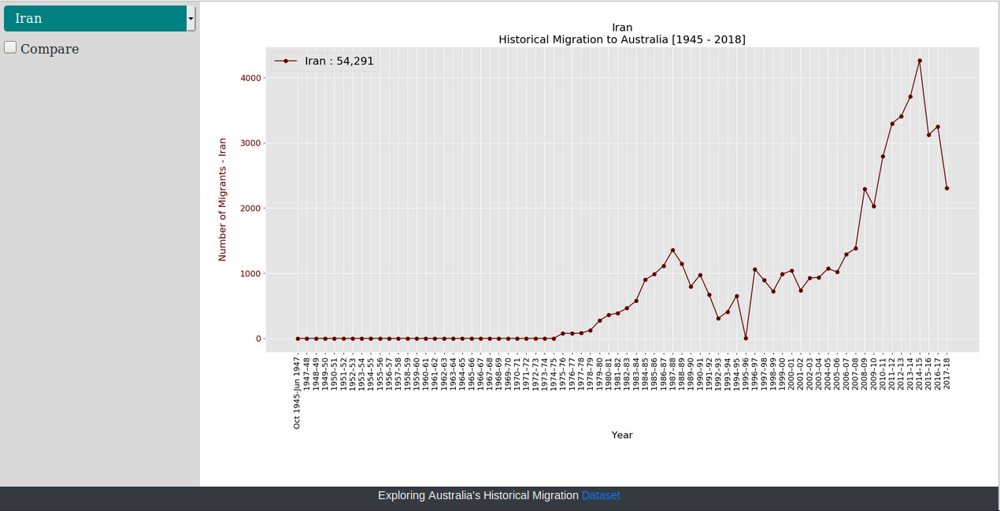
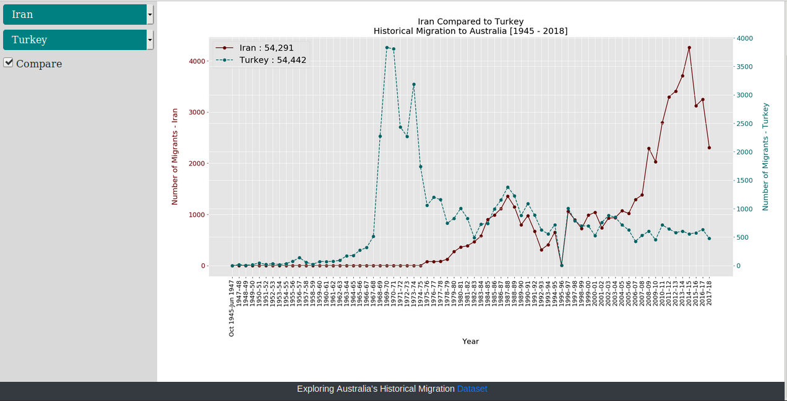

## Australia Historical Migration
### Visualisation & Analytic

This is basically some lines of code for generating **`infographics`** and **`analytic`** material on a dataset regarding history of migration to Australia.

#### deployed on heroku: [ozindex](https://ozindex.herokuapp.com/)

---

### Dataset

**`Data From Year 1945 to Year 2017`**  
**`Data Source: Australia Government; Department of Home Affairs`**  
**`Data Released : April 2019`**
[Link to Data](https://www.homeaffairs.gov.au/research-and-statistics/statistics/visa-statistics/live/historical-migration)

Original dataset has been (considerably) wrangled (in spreadsheet software) before being loaded as a pandas dataframe. Considering the fact that this is a historical dataset with world countries, numbers are not straightforward as countries' border have changed during the time. Of many cases to mention is:  
* South & North Korea numbers are reported together in dataset as “Korea S&N”
* Numbers that belong to Soviet Union are added to the Russia
* All data reported as "<5" has been replaced with zero.
* All data that was not allocated to a known country have been ignored. Such as: “other commonwealth countries”, “not stated”, “at sea and not stated”, etc.
* All countries with migration numbers less than 500 over whole period of 73 years have been removed.

Loaded dataset contains about 14,000 piece of data (`185 rows x 76 columns`)

---

### Web Application

The **`flask`** web application [(here)](https://github.com/SAKiiMA/OZiNDEX/tree/master/app) is more of a personal touch and its main functionality is providing a better access to data.  

`matplotlib` code lines in application are a bit different from what you will see in `jupyter notebook`. Using `pyplot` has been avoided not to cause `memory leak` if not implemented properly.

Most of infographics are happening on home page and “compare” page. On home page there are few chart options to select providing an overall view of data.

Through compare page you can access an individual country’s migration history or compare them to see how economical or political situations affected trends in migration.

Also some statistics and the whole dataset are viewed acordingly.

---

### Jupyter Notebook

If just curious to have a look at `visualisation` / `analytic` you may refer to [jupyter notebook “ozimmig.ipynb”](https://github.com/SAKiiMA/OZiNDEX/blob/master/ozimmig.ipynb).
